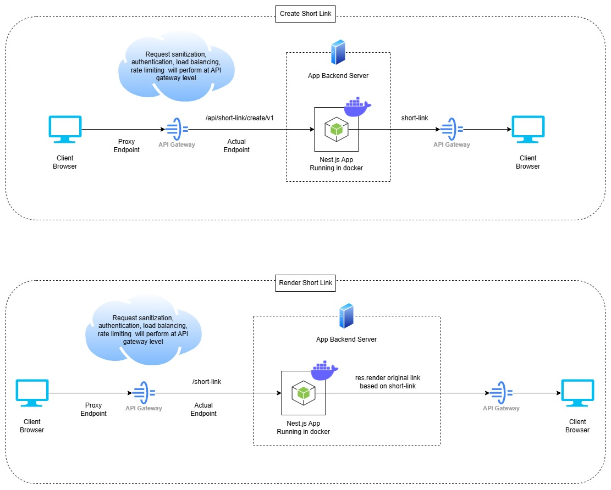

# 🚀 Simple URL

**An open-source, high-performance URL shortening service with advanced features like custom
expiration, bulk short links, and QR code generation.**

Looking for a solution similar to [**Bitly**](https://bitly.com/) or
[**TinyURL**](https://tinyurl.com/)? Look no further! This **Simple URL** is an **open-source
alternative** designed to offer flexibility, scalability, and a feature-rich platform for shortening
long URLs, perfect for **developers**, **startups**, and **businesses**. Whether you're looking to
implement this as part of your own product or simply want to explore a robust, scalable system
architecture, this project has you covered!

With **Simple URL**, you can create and manage millions of short links, generate QR codes, set
custom expiration times, and much more, all backed by a **NestJS** backend, **MongoDB** for
persistent storage, **Redis** for caching, and a **smart, responsive Angular UI**.

## ✨ Why Choose Simple URL?

1. **Advanced URL Shortening Features**:

    - Shorten long URLs with ease, creating easy-to-share, memorable links.
    - Custom expiration times (1 day, 7 days, lifetime).
    - Bulk creation of short links for businesses needing large-scale URL shortening.

2. **QR Code Generation**:

    - Automatically generate QR codes for any URL, making it easier for users to scan and share
      links in both online and offline settings.

3. **High Scalability**:

    - Handle trillions of records efficiently with MongoDB sharding, making it perfect for
      large-scale applications.
    - Process millions of requests concurrently with Redis for caching and high availability.

4. **Responsive & Modern UI**:

    - Built with **Angular**, the user interface is clean, intuitive, and responsive, delivering a
      seamless experience across desktop and mobile devices.

5. **Enterprise-Ready Architecture**:

    - Built for high availability and designed to handle **massive scale**.
    - The architecture leverages **NestJS**, **MongoDB**, and **Redis**, making it an ideal
      exploration ground for developers looking to understand modern web systems.

6. **CI/CD Ready for Lightning-Fast Deployment:**

    - Streamlined, pre-configured CI/CD pipelines ensure your platform is continuously integrated,
      tested, and deployed.
    - Fully Dockerized for consistent, secure, and scalable environments.

## 🏛️ Project Architecture



## 🏗️ Project Structure

```
└── simple-url/
    ├── .github
    │   └── workflows
    ├── LICENSE
    ├── README.md
    ├── architecture
    │   ├── architecture.drawio
    │   └── architecture.jpg
    ├── apps
    │   ├── backend
    │   ├── backend-e2e
    │   ├── frontend
    │   └── frontend-e2e
    ├── devops
    │   ├── backend
    │   └── frontend
    ├── docker-compose.yml
    ├── jest.config.ts
    ├── jest.preset.js
    ├── libs
    │   └── shared
    ├── nx.json
    ├── package-lock.json
    ├── package.json
    ├── scripts
    │   ├── dependency.verifier.js
    │   ├── env.builder.js
    │   ├── frontend.ignite.js
    │   ├── generate.module.js
    │   ├── upgrade.js
    │   └── vs.extensions.setup.js
    └── tsconfig.base.json
```

## ⚡ Quick Start Guide

### Prerequisites:

Ensure that you have the following installed:

-   [Node.js (>= 20.17.0)](https://nodejs.org/en/download/package-manager)
-   [Redis (>= 7.0.0)](https://redis.io/)
-   [Mongo (>= 8.0.0)](https://www.mongodb.com/try/download/community)
-   [Visual Studio Code (Recommended)](https://code.visualstudio.com/Download)
-   [Docker Desktop (Optional)](https://www.docker.com/products/docker-desktop)

### Setup Instructions

1. Clone the repository.
2. Install the project dependencies using the following command:

    ```bash
    npm install
    ```

    This will:

    - Validate your Node.js and npm versions.
    - Install recommended VS Code extensions.
    - Create an environment file from the sample if one does not exist.

3. Run the project using Docker (optional):

    ```bash
    npm run docker:up
    ```

    This is optional, you can run the project even without Docker:

    - Use `npm run frontend:serve` command to run **frontend**.
    - Use `npm run backend:serve` command to run **backend**.

### Frontend Commands

-   **Build**: Builds the frontend project after prompting for the environment.

    ```bash
    npm run frontend:build
    ```

-   **Unit Tests**: Runs unit tests for the frontend.

    ```bash
    npm run frontend:test
    ```

-   **E2E Tests**: Runs E2E tests for the frontend.

    ```bash
    npm run frontend:e2e
    ```

-   **Serve**: Serves the frontend project after prompting for the environment.

    ```bash
    npm run frontend:serve
    ```

### Backend Commands

-   **Build**: Builds the backend project.

    ```bash
    npm run backend:build
    ```

-   **Unit Tests**: Runs unit tests for the backend.

    ```bash
    npm run backend:test
    ```

-   **E2E Tests**: Runs E2E tests for the backend.

    ```bash
    npm run backend:e2e
    ```

-   **Serve**: Serves the backend project.

    ```bash
    npm run backend:serve
    ```

### Upgrade Project Dependencies

There is a custom script to upgrade all project dependencies. If an error occurs during the upgrade,
the script will automatically rollback the changes.

```bash
npm run upgrade
```

### Generate module for frontend or backend

This custom script streamlines the creation of new modules for either frontend or backend projects.
It prompts the user for input on module and component/controller names, generates the necessary
files and directories.

```bash
npm run generate:module
```

## 🔧 Environment Variable Guide for New Variable

1. **Local Development**

    Set up environment variable in a `.env` file.

2. **Local Development with Docker**

    Set up environment variable in both the `.env` file and `docker-compose.yml`.

3. **Dev, UAT, Prod Environments**

    Configure environment variable within CI/CD pipeline files.

**Note**: Depending on the project requirements, you may also need to configure environment variable
in the backend or frontend configuration files.

## 📋 Sample Environment Variables

Below is a sample `.env` file. This file should not contain sensitive or production-specific values.
For real environment variables, ensure they are managed securely.

```env
# ====================== DISCLAIMER =======================
# This file is a sample configuration for environment variables.
# It should be committed to version control to provide a reference
# for required variables and their names. However, it should not
# contain sensitive or production-specific values.
#
# The actual `.env` file should contain real values and must be
# added to .gitignore to prevent it from being tracked in the
# repository. Ensure that sensitive information is securely managed
# and kept private.
# =========================================================

######################################
#### Common Environment Variables ####
######################################
PORT_FRONTEND=4000

# Note: PORT_BACKEND change required inside apps/frontend/src/config/config.ts too
PORT_BACKEND=8000

# Note: APP_ENV can be only LOCAL, DEV, UAT, or PROD
APP_ENV=LOCAL

MIN_NODE_VERSION='20.17.0'
MIN_NPM_VERSION='10.8.2'

#######################################
#### Backend Environment Variables ####
#######################################

# Note: ROUTE_PREFIX change required inside apps/frontend/src/config files and spec file too
ROUTE_PREFIX=api

KEY_VAULT_URI=
TENANT_ID=
CLIENT_ID=
CLIENT_SECRET=

REDIS_HOST=127.0.0.1    #This must be kept inside secret-vault instead of .env
REDIS_PORT=6379
MIN_REDIS_VERSION='7.0.0'

MIN_MONGO_VERSION='8.0.0'
MONGO_CONNECTION_URI=mongodb://localhost:27017/ #This must be kept inside secret-vault instead of .env
MONGO_DB_NAME=simple-url    #This must be kept inside secret-vault instead of .env

########################################
#### Frontend Environment Variables ####
########################################
```

## 🔌 Default Ports and Routes

-   Frontend: http://localhost:4000
-   Backend: http://localhost:8000
-   Swagger API Documentation: http://localhost:8000/api/swagger

## 💻 API: Flexible and Developer-Friendly

The backend API lets you compile and execute code from any client interface. Here’s an example:

#### Request Model:

```json
{
    "OriginalLink": "https://www.instagram.com/samcrist2244/",
    "ExpireTime": 1
}
```

#### Example API Request (cURL):

```bash
curl --location 'http://localhost:8000/api/short-link/create/v1' \
--header 'Content-Type: application/json' \
--data '{
    "OriginalLink": "https://www.instagram.com/samcrist2244/",
    "ExpireTime": 1
}'
```

### Example Responses:

#### **Success Response:**

```json
{
    "IsSuccess": true,
    "Message": "Success",
    "Data": {
        "OriginalLink": "https://www.instagram.com/samcrist2244/",
        "ShortLink": "http://128.199.31.53:8000/aV5EE2zP"
    },
    "Errors": []
}
```

#### **Error Response:**

```json
{
    "IsSuccess": false,
    "Message": "Bad Request Exception",
    "Data": null,
    "Errors": [
        {
            "Exception": {
                "message": ["Invalid ExpireTime. Supported values are 1, 7, 0."],
                "error": "Bad Request",
                "statusCode": 400
            }
        }
    ]
}
```

## 🌍 Who Can Benefit?

-   **Developers**: Gain hands-on experience with high-scale, distributed systems.
-   **Businesses**: Increase user engagement with shorter, shareable links.
-   **Entrepreneurs**: Build your own URL shortening service with full control and customization.
-   **Marketers**: Generate bulk short URLs with ease and provide users with QR codes.

## 👨‍💻 Author Information

-   **Author**: Karan Gupta
-   **LinkedIn**: [Karan Gupta](https://www.linkedin.com/in/karangupta0005)
-   **GitHub**: [Karan Gupta](https://github.com/Karan0005)
-   **Contact**: +91-8396919047
-   **Email**: [karangupta0005@gmail.com](mailto:karangupta0005@gmail.com)

## 🌱 **Powered by Simple Web App Boilerplate**

We built **simple-url** using the amazing
**[Simple Web App Boilerplate](https://github.com/Karan0005/simple-web-app-boilerplate)**. This
open-source boilerplate made the development process fast and efficient, It’s the perfect starting
point for any project, saving time and effort. Check it out and speed up your development just like
we did!

## 🤝 Contributions

Contributions are welcome! Here are several ways you can contribute:

1. **Fork the Repository**: Start by forking the project repository to your github account.

2. **Clone Locally**: Clone the forked repository to your local machine using a git client.

    ```sh
    git clone https://github.com/Karan0005/simple-url
    ```

3. **Create a New Branch**: Always work on a new branch, giving it a descriptive name.

    ```sh
    git checkout -b new-feature-x
    ```

4. **Make Your Changes**: Develop and test your changes locally.

5. **Commit Your Changes**: Commit with a clear message describing your updates.

    ```sh
    git commit -m 'Implemented new feature x.'
    ```

6. **Push to github**: Push the changes to your forked repository.

    ```sh
    git push origin new-feature-x
    ```

7. **Submit a Pull Request**: Create a PR against the original project repository. Clearly describe
   the changes and their motivations.

8. **Review**: Once your PR is reviewed and approved, it will be merged into the main branch.
   Congratulations on your contribution!

-   **[Report Issues](https://github.com/Karan0005/simple-url/issues)**: Submit bugs found or log
    feature requests for the `simple-url` project.

## 📝 License

This project is licensed under the MIT License.
